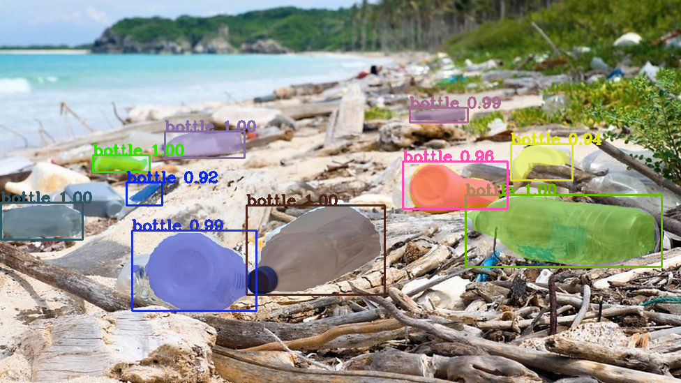
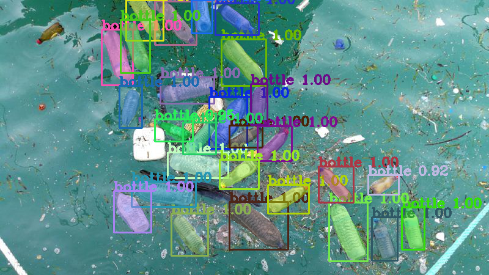

# Mask R-CNN for Bottle Object Detection and Segmentation

This is an implementation of [Mask R-CNN](https://arxiv.org/abs/1703.06870) on Python 3, Keras, and TensorFlow. The model generates bounding boxes and segmentation masks for each instance of bottle in the image. It's based on Feature Pyramid Network (FPN) and a ResNet101 backbone. The custom dataset images of bottles collected from the internet. The coco weights and code customised and adapted from Matterport, Mask R-CNN-{\url{https://github.com/matterport/Mask_RCNN}} for bottle segmentation training. 

The repository includes:
* Source code of Mask R-CNN built on FPN and ResNet101.
* Training code 
* Pre-trained weights for Bottle custom dataset
* Jupyter notebooks to visualize the detection pipeline at every step
* Evaluation as per MSCOCO metrics (AP)


* ([model.py](mrcnn/model.py), [utils.py](mrcnn/utils.py), [config.py](mrcnn/config.py)): These files contain the main Mask RCNN implementation. 

* bottle/inspect_bottle_data.ipynb  This notebook visualizes the different pre-processing steps to prepare the training data.
* bottle/inspect_bottle_model_check.ipynb  This notebook goes in depth into the steps performed to detect and segment objects. It provides visualizations of every step of the pipeline.
* bottle/inspect_bottle_weights.ipynb  This notebooks inspects the weights of a trained model and looks for anomalies and odd patterns.
* bottle/model-videosegmentation.ipynb    This notebook contains video segmentation.
* bottle/Eval_model.ipynb     This notebook contains model evaluation and image segmentation 
* bottle/bottle.py contains the code for training and segmentation.


## Step by Step Detection

    ## 1. Anchor sorting and filtering
    ## 2. Bounding Box Refinement
    ## 3. Mask Generation
    ## 4. Layer activations
    ## 5. Weight Histograms
    ## 6. Composing the different pieces into a final result

# Training
Pre-trained weights for Bottle custom dataset added to the repository for using as a base weight for extension of this work as per individual requirement to create variations on the network. Jupyter Notebook python codes can be used for training and detection.

## Train the bottle model

The code in `bottle.py` is set to train for 1000K steps (1 epochs of 1000 steps each), and using a batch size of 1.

    # Train a new model starting from pre-trained COCO weights 
    python bottle/bottle.py train --dataset=/path/to/bottle/dataset --weights=coco

    # Resume training a model that you had trained earlier
    python bottle.py train --dataset=/path/to/bottle/dataset --weights=last

    # Train a new model starting from ImageNet weights
    python bottle.py train --dataset=/path/to/bottle/dataset --weights=imagenet
    
    # Train a new model starting from pre-trained bottle weights
    python bottle/bottle.py train --dataset=/path/to/bottle/dataset --weights=<path to weight>
    
   eg;
     #  python bottle/bottle.py train --weights=logs/mask_rcnn_bottle_0100.h5 --dataset=dataset --layer='4+' --aug='Fliplr'
    
    Model Training optional Parameter:
    =================================
    --layer = "'heads' or '4+' or '3+' or 'all' "
    --epoch = " Enter no of epoch for training " default value set as '1'        
    --aug = "'Fliplr' or 'Flipud'" default set to None


## Segmentation 

    # Apply color segmentation to bottles for a particular image file
    python bottle/bottle.py segment --weights=/path/to/weights/file.h5 --image=<URL or path to file>
 

    # Apply color segmentation to bottles for all images in a folder
    python bottle.py segment --weights=/path/to/weights/file.h5 --imagefolder=<path to folder>
        

    # Apply color segmentation to bottles video using the last weights you trained
    python bottle.py segment --weights=last --video=<URL or path to file>


    --image = Image file path to apply the color segmentation
    --imagefolder = Images folder name to apply the color segmentation
    --video = Video file path to apply the color segmentation
    
   eg;
     #  python bottle/bottle.py segment --weights=mask_rcnn_bottle.h5 --imagefolder=images                                                          

## Requirements
Python 3.7, TensorFlow-gpu 1.5, Keras 2.2.4 and other common packages listed in `requirements.txt` for linux Installation

## Installation 
1. Clone this repository.
2. Install dependencies
   ```bash
   pip install -r requirements.txt
   ```
3. Run setup from the repository root directory
    ```bash
    python setup.py install
    ``` 
3. Download pre-trained bottle weights (mask_rcnn_bottle.h5) from release section for segmentation. The model weight from logs folder is a git lfs file and git clone doesn't download the file completely. Note: The file size is 244MB. Use git lfs pull or download the file directly.

4. Run training or segmentation task from terminal.  


### MS COCO Requirements 
To train or test on MS COCO, you'll also need:
* pycocotools 
* [MS COCO Dataset](http://cocodataset.org/#home)
* Download the 5K [minival](https://dl.dropboxusercontent.com/s/o43o90bna78omob/instances_minival2014.json.zip?dl=0)
  and the 35K [validation-minus-minival](https://dl.dropboxusercontent.com/s/s3tw5zcg7395368/instances_valminusminival2014.json.zip?dl=0)
  subsets. More details in the original [Faster R-CNN implementation](https://github.com/rbgirshick/py-faster-rcnn/blob/master/data/README.md).
* Custom dataset images are downloaded from various internet sources and annotated using pixel by pixel polygon annotation for training the model. The dataset folder has images and the json annotation file. Please note, it does not include all images used for training the model for bottle segmentation.
  
### Image and video segmentation 
 



